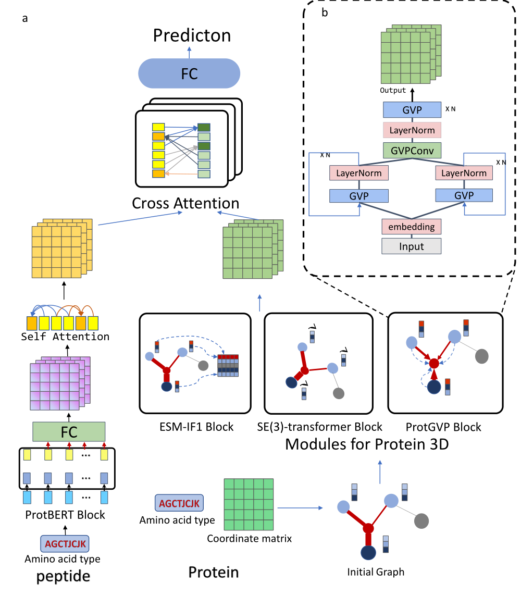
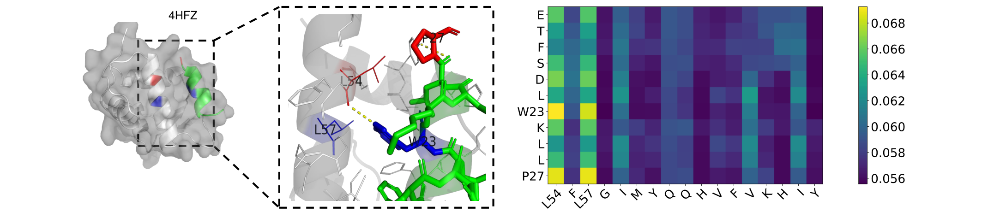
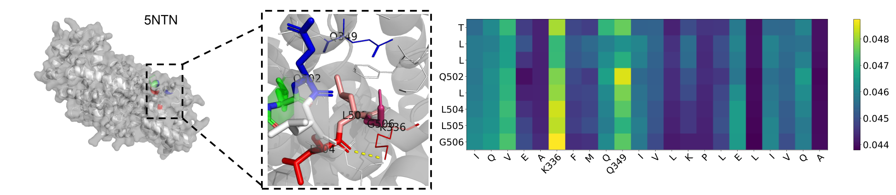
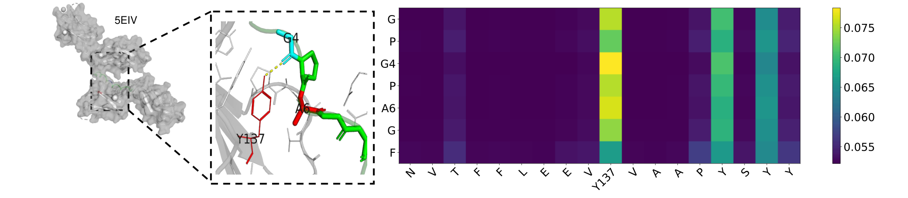
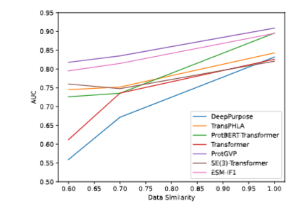
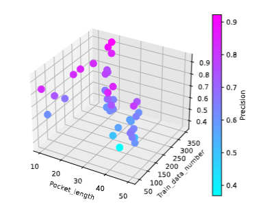

# De Novo Design of Target-Specific Ligands Using BERT-Pretrained Transformer

<center>



</center>


## Requirements

We think the requirements for the environment are so loose that any version can be used

```
cuda 10.2
conda install gxx_linux-64 7.3
conda install pytorch==1.8.1 torchvision==0.9.1 torchaudio==0.8.1 cudatoolkit=10.2 -c pytorch
conda install pyg -c pyg -c conda-forge
conda install tqdm
conda install -c jrybka sklearn
conda install -c conda-forge tensorboard
conda install -c conda-forge jsonlines
```

<!-- All the large files (data, model weight files, full results, etc.) can be downloaded [here](https://drive.google.com/drive/folders/1EGzLhcXD5jWuTRhK5fmSuYp3PWu3KXVd?usp=share_link) -->
## Prepare Data

pepbdb data:http://huanglab.phys.hust.edu.cn/pepbdb/
propedia data:http://bioinfo.dcc.ufmg.br/propedia/download

Detailed data processing steps are given in the [readme](https://github.com/AI-ProteinGroup/Protein-Peptide-Interactions/blob/main/dataprocess/readme.md) of the dataprocess
## Train ESM-IF1 of our model

Go to the ESM-IF1 folder and run the train_mySE3.py file

```python
python train_esm.py
```
Empty logs/, models/, and save/ folders is needed to store procedures, breakpoints, and final results.

## Train SE(3)-Tansformer of our model

Go to the SE(3)-Tansformer folder and run the train_mySE3.py file

```python
python train_mySE3.py
```
Empty logs/, models/, and save/ folders is needed to store procedures, breakpoints, and final results.

## Train ProtGVP of our model

Go to the ProtGVP folder and run the train_ProtGVP.py file

```python
python train_ProtGVP.py
```
Empty logs/, models/, and save/ folders is needed to store procedures, breakpoints, and final results.

<!-- ## Data

<table class="tg">
<thead>
  <tr>
    <th class="tg-c3ow" colspan="1">data_name</th>
    <th class="tg-c3ow" colspan="1">path</th>
    <th class="tg-c3ow" colspan="1">description</th>
  </tr>
</thead>
<tbody>
  <tr>
    <td class="tg-c3ow">Binding DB</td>
    <td class="tg-c3ow">data/dataset_train.csv<br>data/dataset_valid.csv<br>data/dataset_test.csv</td>
    <td class="tg-c3ow">Pairwise data of protein sequence and molecular sequence</td>
  </tr>

<tr>
    <td class="tg-c3ow">ChEMBL</td>
    <td class="tg-c3ow">data/chembl_28_pxc_5.txt </td>
    <td class="tg-c3ow">Active molecules were selected for PXC > 5 molecules</td>
  </tr>
    <tr>
    <td class="tg-c3ow">Uniport/Swissport</td>
    <td class="tg-c3ow">data/uniprot_human_all.xlsx</td>
    <td class="tg-c3ow">Human protein Data</td>
  </tr>
</tbody>
</table>

All the above data can be found [here](https://drive.google.com/drive/folders/1owQfTuer67qlN3OG0xtFSJzy_ebOIuTu?usp=share_link) -->

## Attention 




Fig. 4 Visualization and Attention matrix on 4HFZ. L54 forms a hydrogen bond with W23 (yellow line segment), where L57 is physically close to the W53 amino acid (blue) and P27 is physically close to L54 (red).
<center>

</center>

Fig. 5 Visualization and Attention matrix on 5NTN. L504 forms a hydrogen bond with K336 (yellow line segment), where L505 is physically close to K336 amino acid (pink), G506 is physically close to K336 (Burgundy), and Q502 is physically close to Q349 (blue).
<center>

</center>
Fig. 6 Visualization and Attention matrix on 5EIV. G4 creates a hydrogen bond with Y137 (yellow line segment), where A6 is physically close to the
amino acid Y137 (red)


## model performance evaluation

<center>



Fig.2 Changes in AUC under Different Similarities of Each Model.


</center>

Fig.4 The relationship between precision and the amount of training data and pocket size.
## tode

More details will be given in the future.
